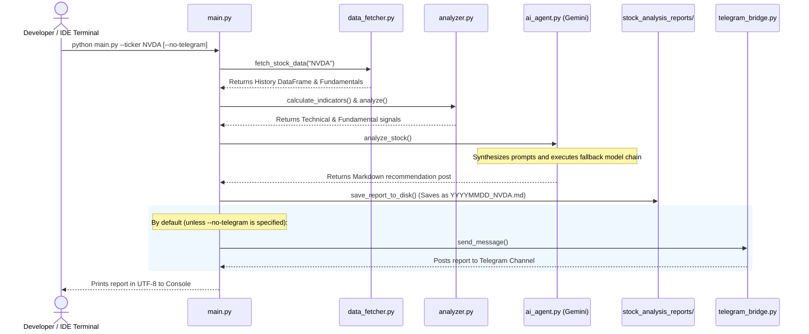
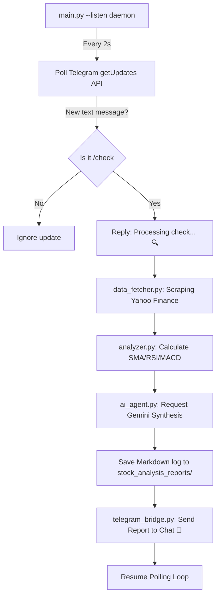

# 🧠 Stock Market AI Agent Skills & Flow

This document details the functional skills, algorithmic configurations, and operational flows of your Stock Market AI Agent.

---

## 💬 IDE Chat Commands

You can type the following slash commands directly in the IDE chat, and the AI Agent will automatically translate and execute the corresponding Python CLI script on your behalf:

1. **Standard Stock Check**:
   ```text
   /check <ticker_name>
   ```
   *Underlying Command:* Runs `.\.venv\Scripts\python.exe main.py --ticker <ticker_name>`

2. **Hebrew Portfolio Position Analyzer**:
   ```text
   /analyze -<ticker_name> -pp <purchase_price>
   ```
   *Underlying Command:* Runs `.\.venv\Scripts\python.exe main.py --analyze-ticker <ticker_name> --purchase-price <purchase_price>`

3. **Strategy-Based Stock Position Analyzer**:
   ```text
   /analyze-stra -<ticker_name> -it <investment_type> -ip <investment_period> -pp <purchase_price>
   ```
   *Underlying Command:* Runs `.\.venv\Scripts\python.exe main.py --analyze-ticker <ticker_name> --purchase-price <purchase_price> --investment-type <investment_type> --investment-period "<investment_period>"`

---

## 🛠️ Core Agent Capabilities (Skills)

### 1. Market Data Ingestion (`data_fetcher.py`)
*   **US Market Ingestion**: Automatically scrapes 1 year of daily historical prices and key valuation parameters for NYSE/NASDAQ symbols (e.g. `AAPL`, `NVDA`, `PLTR`).
*   **Israeli Market (TASE) Ingestion**: Scrapes Hebrew-market assets from the Tel Aviv Stock Exchange using the standard `.TA` suffix on Yahoo Finance (e.g. `TEVA.TA`, `ICL.TA`).
*   **Robust Metadata Extraction**: Safely parses financial statements to retrieve P/E ratios, forward P/E, EPS, dividend yield, debt-to-equity ratios, and profit margins.

### 2. Algorithmic Technical Diagnostics (`analyzer.py`)
Performs mathematical statistical equations directly on pandas data matrices (completely offline, without external analytics APIs):
*   **Wilder's RSI (14)**: Analyzes stock momentum to flag Overbought (>70) or Oversold (<30) zones.
*   **Simple Moving Averages (50/200 SMA)**: Identifies strong long-term structural trends (Golden Crosses and Death Crosses).
*   **MACD (12, 26, 9)**: Tracks shorter-term trend momentum crossovers and histogram divergences.

### 3. Quantitative AI Reasoning (`ai_agent.py`)
*   **Dynamic Context Assembly**: Packages historical candles, technical indicators, and fundamental metrics into a clean JSON structure.
*   **Multi-Model Fallback Sequence**: Includes a fail-proof model attempt array (`gemini-2.5-flash` ➡️ `gemini-2.0-flash` ➡️ `gemini-flash-latest` ➡️ `gemini-3.5-flash` ➡️ `gemini-2.5-pro`) to automatically bypass temporary API overloads (503) or quota limitations (429).
*   **Hedge-Fund Strategist persona**: Instructs Gemini to act as a senior quant analyst to recommend Entry Ranges, Targets, and strict Stop-Loss levels.

### 4. Interactive Operations & Broadcasting (`main.py` + `telegram_bridge.py` + `email_bridge.py`)
*   **Local Archive Logging**: Saves every report in the `stock_analysis_reports/` directory as a Markdown (`.md`) document.
*   **Interactive bot polling**: Runs a real-time polling listener that responds instantly to `/check <symbol>` commands from authorized chats.
*   **Email Communication Bridge**: Formats the synthesized analytical reports into dynamic, responsive HTML emails with Right-to-Left (RTL) alignments and securely dispatches them to your inbox via TLS (SMTP Port 587).

---

## 🔄 Agent Operational Flows

### Flow A: Direct Command-Line Scanner (CLI Trigger)
Used for manual checks directly from your IDE terminal or automated schedulers.



---

### Flow B: Interactive Telegram Polling Daemon (`--listen` Mode)
Ideal for hosting a live bot that continuously answers questions.



---

## 🚀 Supported CLI & IDE Execution Commands

Here are the complete copy-pasteable commands to trigger each of the Stock Market Agent flows from your IDE terminal:

### 1. Standard Single Stock Check
Runs the full analysis cycle (fetches, calculates technicals/fundamentals, synthesizes with Gemini, and posts to Telegram):
```bash
.\.venv\Scripts\python.exe main.py --ticker PLTR
```
*Add `--no-telegram` to run locally without broadcasting to the channel:*
```bash
.\.venv\Scripts\python.exe main.py --ticker PLTR --no-telegram
```

### 2. Market Sweeps (US or Israel Portfolio)
Sweeps all default US or Israeli stocks listed in `config/config.py` in batch:
```bash
.\.venv\Scripts\python.exe main.py --market us
.\.venv\Scripts\python.exe main.py --market il
```

### 3. Custom Position Portfolio Analyzer (Hebrew Flow)
Runs the isolated portfolio position tracking, analyzing performance, support/resistance touches, and consolidation relative to your purchase price. Outputs a premium report in Hebrew:
```bash
.\.venv\Scripts\python.exe main.py --analyze-ticker OPAL.TA --purchase-price 350
```
*To run the portfolio analyzer locally without broadcasting to Telegram:*
```bash
.\.venv\Scripts\python.exe main.py --analyze-ticker OPAL.TA --purchase-price 350 --no-telegram
```

### 4. Custom Strategic Position Analyzer (Strategy-Driven Hebrew Flow)
Runs strategic analysis on a position based on custom investment types (e.g. *swing*, *long-term*) and investment time periods (e.g. *2 months*, *1 year*). Customizes support/resistance windows and moving averages to the specific period:
```bash
.\.venv\Scripts\python.exe main.py --analyze-ticker NVDA --purchase-price 216.88 --investment-type swing --investment-period "2 months"
```
*To run the strategic position analyzer locally without broadcasting to Telegram:*
```bash
.\.venv\Scripts\python.exe main.py --analyze-ticker NVDA --purchase-price 216.88 --investment-type swing --investment-period "2 months" --no-telegram
```

### 5. Interactive Telegram Listener Daemon
Starts polling updates to answer `/check <symbol>` commands inside Telegram in real-time:
```bash
.\.venv\Scripts\python.exe main.py --listen
```

---

## 📈 Executive Post Format Schema

Every broadcast recommendation report is generated using the following premium, mobile-optimized visual schema:

📊 **[TICKER] - [Company Name]**
💼 Sector: [Sector] | Industry: [Industry]
💵 Current Price: [Price] [Currency] | Market Cap: [Formatted Cap]
━━━━━━━━━━━━━━━━━━━━
📈 **TECHNICAL DIAGNOSTICS**
• RSI (14): `[RSI]` - **[RSI Signal Status]**
• Trend (50/200 SMA): **[Trend Status]** (50: `[SMA50]`, 200: `[SMA200]`)
• MACD: **[MACD Status]** (Hist: `[MACD Hist]`)
━━━━━━━━━━━━━━━━━━━━
🏛️ **FUNDAMENTAL HEALTH**
• P/E Ratio: `[PE]` | Forward P/E: `[Forward PE]`
• EPS: `[EPS]` | Profit Margin: `[Margin]%`
• Div Yield: `[Yield]%` | Debt-to-Equity: `[Debt/Equity]`
━━━━━━━━━━━━━━━━━━━━
🧠 **QUANTITATIVE AI THESIS**
🟢 **Bullish Thesis**: [Quantitative structural bullish catalyst]
🔴 **Risk Vector**: [Primary fundamental or technical warning]
━━━━━━━━━━━━━━━━━━━━
🎯 **EXECUTIVE RATING & ACTION LEVELS**
🏆 **Action Rating**: **[STRONG BUY / BUY / HOLD / AVOID]**
🏁 **Target Entry**: `[Price Range]`
🚀 **Target Price**: `[Calculated Target]`
🛑 **Stop-Loss**: `[Strict Downside Capital Protection]`

⚠️ *Disclaimer: Algorithmic quantitative financial evaluation. Perform your own due diligence.*
