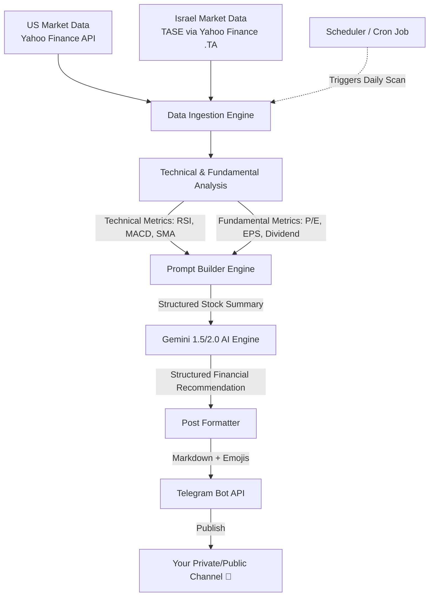

# 📈 Stock Market AI Agent Assistant (US & Israel)

A personal, automated Stock Market AI Agent that analyzes both **US Markets** and **Israeli Markets (TASE)**, uses Gemini LLM to generate professional financial reports/recommendations, and broadcasts them automatically to a **Telegram Channel**.

---

## 🏗️ System Architecture

---

## 🌟 Key Features

1. **Dual Market Coverage**:
   - **US Market**: Standard tickers (e.g., `AAPL`, `MSFT`, `NVDA`).
   - **Israeli Market (TASE)**: Tickers with `.TA` suffix (e.g., `TEVA.TA`, `ICL.TA`, `ONE.TA`).
2. **Multi-Dimensional Analysis**:
   - **Technical Indicators**: Calculates Moving Averages (SMA/EMA), Relative Strength Index (RSI), and MACD.
   - **Fundamental Health**: Extracts P/E ratio, Market Cap, EPS, Profit Margins, and Dividend Yield.
3. **AI-Powered Synthesis**:
   - Feeds real-time indicators to Gemini to construct a professional, objective analysis.
   - Eliminates emotional bias by following a strict risk-reward evaluation template.
4. **Rich Telegram Broadcasting**:
   - Modern, emoji-enhanced Telegram messages formatted in clean markdown.
   - Automatic Buy / Hold / Sell ratings with entry points, targets, and stop-loss recommendations.

---

## 🛠️ Proposed Tech Stack Options

Depending on your preference, we can build the core engine in either **Python** or **TypeScript/Node.js**:

| Feature | 🐍 Python (Recommended for Data) | 🟢 Node.js / TypeScript |
| :--- | :--- | :--- |
| **Data Fetching** | `yfinance` (Excellent support) | `yahoo-finance2` (Solid JS library) |
| **Analysis** | `pandas`, `pandas-ta` (Industry standard) | Custom calculations or lightweight NPM libs |
| **AI Integration** | `google-genai` (Official SDK) | `@google/genai` (Official SDK) |
| **Telegram Bot** | `python-telegram-bot` or requests | `telegraf` or `node-telegram-bot-api` |
| **Ideal for...** | Heavy analysis, charting, mathematical indicators | Fast server, microservices, lightweight execution |

---

## 📅 Roadmap to Launch

### Phase 1: Foundation & Data Fetching
- Initialize the codebase (Python or TypeScript).
- Write functions to fetch key stock data (historical prices, financial stats) for both US and Israeli stocks.
- Verify Tel Aviv stock symbols (`.TA`) correctly pull from Yahoo Finance.

### Phase 2: Financial Analysis Engine
- Implement a math module to calculate:
  - **RSI (14)** (identifies overbought/oversold conditions).
  - **Simple Moving Averages (50, 200)** (identifies trends).
  - **MACD** (trend momentum).
- Consolidate fundamental stats (P/E ratio, debt ratio, dividend yield).

### Phase 3: AI Reasoning (Gemini SDK)
- Configure the Gemini API client.
- Create a carefully crafted system prompt that guides Gemini to act as a seasoned hedge fund analyst.
- Format Gemini's raw output into structured buy/sell theses.

### Phase 4: Telegram Channel Integration
- Set up a Telegram Bot using `@BotFather`.
- Obtain Channel ID and configure bot permissions to post messages.
- Test message publishing with rich formatting (bold text, code blocks, emojis, charts).

### Phase 5: Automation & Deployment
- Set up a scheduler (e.g., a lightweight cron job or GitHub Action) that runs every weekday.
- US markets run on US schedule; Israel markets run on Israel schedule (Sunday - Thursday).

---

## 🔑 Required API Keys & Credentials
To build and run this agent, you will need:
1. **Google Gemini API Key**: For AI recommendations (available via Google AI Studio).
2. **Telegram Bot Token**: Created via Telegram `@BotFather`.
3. **Telegram Channel ID**: The public handle `@your_channel` or private chat ID where your bot will publish.
